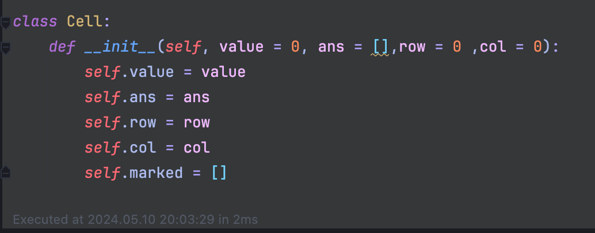
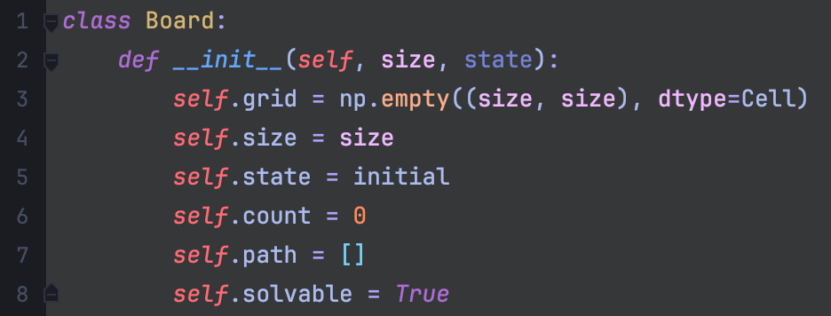
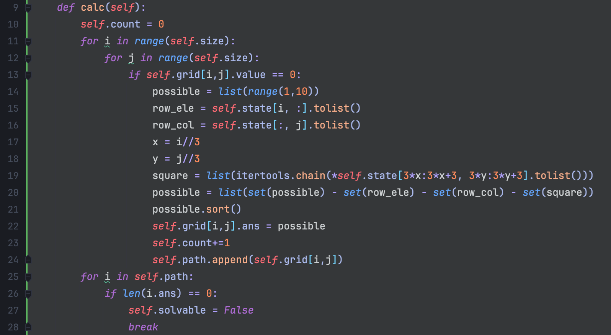
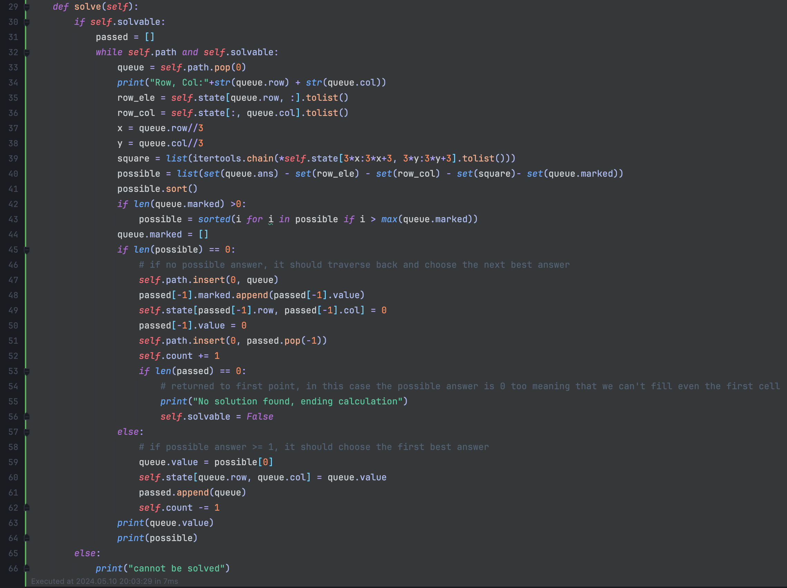

# Simple Sudoku Algorithm

This program solves Sudoku puzzles automatically or tells you if it is unsolvable. The user is able to input any standard Sudoku puzzle and this program can solve it.

# How It Works
## Setup (init)
First off, we make a Cell class to keep track of each cell's position, value, and other useful variables. 

After that we can start with the board. While we allow the user to set the size of the board, the program only works with a 9 by 9 board, the standard for Sudoku. When initialized, the program would create the board as well as certain variables including the path between each empty cell, a count of the missing values, and whether it is actually possible to solve or not. All of these will be used later when actually solving.

## Initial Calculations (calc)
The first step that this program does when solving Sudoku is to first check the empty spaces of what value can actually be inputted into that cell. For example, there is no point in checking later if a "3" can be put into this cell if in the same row there is already a "3". That is the purpose of this initial calculation. This step also checks whether it is possible to solve said puzzle. Also, the program counts how many empty spaces in this step as well.

To start, we go through each cell in the board and if the program detects that there is a "0", then it will start to calculate the possible numbers that can fit in that cell. It starts off by getting a list of all numbers used in Sudoku (1-9). It then gets a list of all the numbers in the same row and column, as well as in the same 3 by 3 square. This is what "row_ele", "row_ele", and "square" does. We then use those lists of numbers and subtract them from the list of all numbers, making a list of only possible numbers left. Lastly, we save the list of remaining numbers into the board, add 1 to the counter of empty cells, and then add the cell into the path for later use.

One final check is whether that this puzzle is solvable or not. To do this, the program simply does a check of all cells in the board path, the ones that we know are empty and needs to be solved, and see the length of the list of possible answers. If it finds an empty cell with no possible answers, then the puzzle is automatically flagged as unsolvable.

## Actually Solving Sudoku (solve)
How the Simple Sudoku Algorithm solves Sudoku is with backtracking. To start, we first check if the current board is flagged as unsolvable or not, otherwise we would be wasting resources on trying to solve an unsolvable puzzle. Next, we load in the first cell that is empty and try to solve that. Similar to the initial calculations, we check the row, column, and 3 by 3 square for numbers to remove from our possible answers to that cell. Additionally, we remove previously wrong possible answers, more on this later, from the list of possible answers using the set queue.marked. After that we simply sort the list of possible answers. The algorithm then checks the length of queue.marked (which contains a list of marked or unusable numbers). If the length is longer than 0, we update the "possible" list to contain only numbers that are greater than the maximum marked value. We then reset the queue.marked to become an empty list, so it is ready for the next state. Next, the program checks if there is an available answer by checking the length of the list. If there IS 1 or more answers, the program sets the LOWEST number as its answer, prints out the value for the user, and then ticks down the counter of remaining empty cells. However, if there ISN'T an available answer, the program will revert to the step before. It will revert the previous cell back to empty, put it back into the list of cells that need to be solved, and the counter is tickled back up by 1. The program will also mark the value as a non-usable answer to queue.marked so that in the next loop, it will not be used again.

By doing this as many times as needed, the program will keep moving forward when it has a choice, and backtrack when it doesn't. In the end, a completed Sudoku puzzle will be its output. The program also outputs the current cell that it is on, with the value that it has entered, and the possible choices that it had to choose from.

# Summary/TLDR
This program can solve any solvable Sudoku puzzle by checking for the possible answers in each empty cell and trying them out. If initially before actually solving the puzzle that there is no possible answer for a cell, then the program will stop and say that it is not solvable. If there is at least 1 possible solvable answer for each cell, it will go to each empty cell and using the first possible answer for that cell, It will then move on until there is no possible answer for that cell or get to the end. If there is no possible answer, then it will traverse back and choose the next possible answer and so on.
